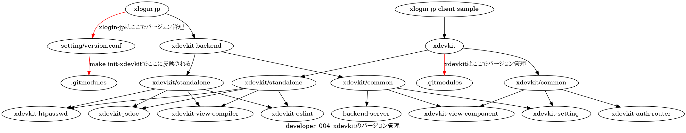

# xlogin-jp

# API document
[https://autoaim-jp.github.io/xlogin-jp/](https://autoaim-jp.github.io/xlogin-jp/)

# tag
マイクロサービスアーキテクチャ, docker, asocial
jsdoc, eslint, Node.js, docker-compose, git, GitHub Workflow, jest
vim, PostgreSQL, redis, xdevkit, GitHub Pages

# architecture

